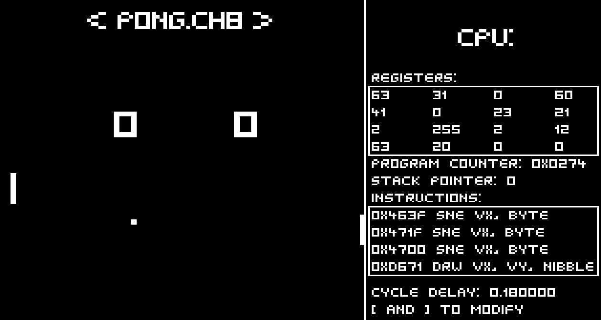
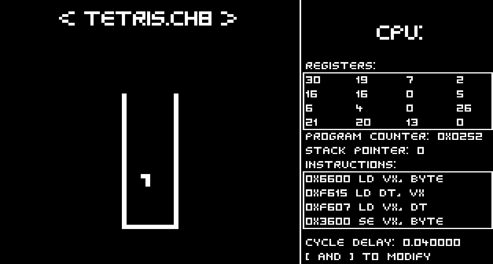

# CHIP-8-Emulator
Chip8 Emulator fully developed in C++

# Guide
Press left and right arrows to change the game

# Building
Run GenerateProject.bat

# References
For the emulator:
https://austinmorlan.com/posts/chip8_emulator/#loading-a-rom
http://www.cs.columbia.edu/~sedwards/classes/2016/4840-spring/designs/Chip8.pdf
http://devernay.free.fr/hacks/chip8/C8TECH10.HTM

Framework.h was inspired by olcPixelGameEngine:
https://github.com/OneLoneCoder/olcPixelGameEngine
